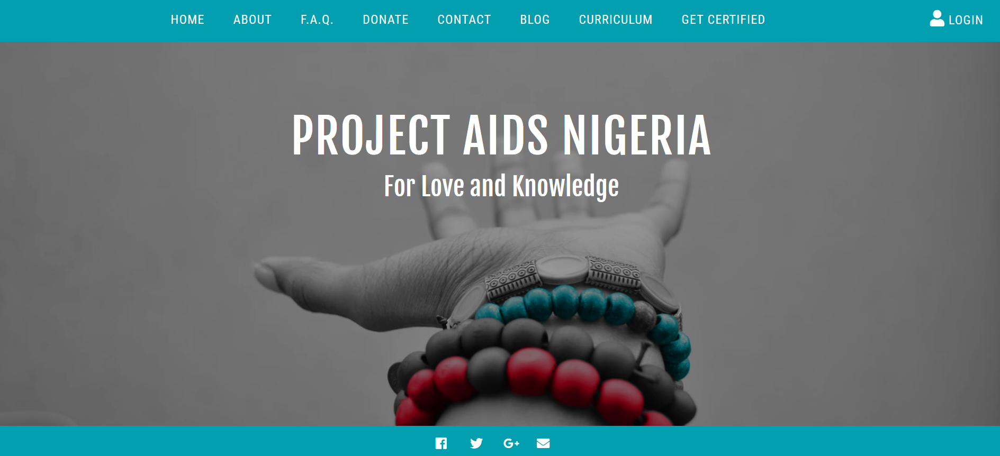

<h1>Porject AIDS Nigeria</h1>
<h4><em>- For Love and Knowledge</em></h4>
<h3>Mission:</h3>

Project AIDS Nigeria is organized exclusively for the charitable and educational purpose of helping rural communities in Nigeria combat the HIV/AIDS epidemic. We achieve this goal by providing education for the prevention of HIV/AIDS through a Christian perspective and by working closely with local hospitals to better serve their HIV/AIDS patients. Project AIDS Nigeria (PAN) delivers educational workshops about HIV and other sexually transmitted diseases to prevent new infections and to reduce the stigma associated with HIV. Project AIDS Nigeria also works closely with local hospitals to help them better serve their HIV/AIDS patients through providing volunteers for certain tasks or aiding with non-medicinal material needs.

<h3>Description:</h3>
<ul>
<li>Home, About, F.A.Q, and Blog are static pages.</li>
<li>Donate: A live link to the PAN paypal account.</li>
<li>Contact: A form that allows the user to email PAN directly from the website.</li>
<li>Curriculum: A page dedicated to bring awareness to students about HIV/AIDS.
Students can select a topic of interest and the interactive videos will pause and ask questions to check for understanding.
 </li>
 <li>Get Certified: Prospective club sponsors can view PAN curriculum before submitting an application and completing a certification test.</li>
 <li>Login: Allows users to make a blog post.</li>

</ul>

<a href="https://project-aids-nigeria.herokuapp.com/">Link to Deployed Site</a>

<h3>Developers:</h3>
<ul>
<li>James Erickson</li>
<li>Alicia Perez</li>
<li>Nitya Kandukuri</li>
<li>Neeha Jacob</li>
<li>Celeste Ramirez</li>
</ul>
